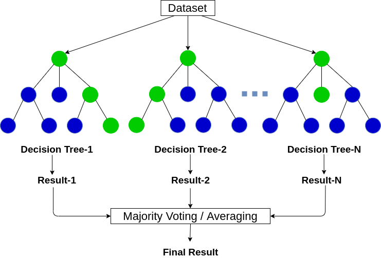

# RandomForest-Sort-of-from-Scratch-

### Here is a simple 'from scratch'(sort of) implementation of the Random Forest ensemble method.

It is 'sort of' because I have used the direct implementaion of decision tree from the sklearn library to create the individual leaners.
The notebook provided is self explanatory and anyone could follow it.

#### This is a very implementation of RandomForest and it has its shortcomigs. 

